# 실시간 지하철 혼잡도 분석 시스템

MSA 기반 실시간 데이터 파이프라인 및 AI 챗봇을 활용한 지하철 혼잡도 분석 플랫폼

---

## 프로젝트 개요

서울교통공사 공식 혼잡도 데이터(240개 역, 1,663건)를 기반으로 실시간 지하철 혼잡도 정보를 제공하는 프로덕션 레벨의 데이터 엔지니어링 플랫폼입니다. 단순한 토이 프로젝트가 아닌, 실무 환경을 완벽히 재현한 End-to-End 파이프라인을 구축했습니다.

## 프로젝트 정보

| 항목 | 내용                                 |
|------|------------------------------------|
| **프로젝트명** | 실시간 지하철 혼잡도 분석 시스템                 |
| **프로젝트 유형** | 개인 프로젝트                            |
| **개발 기간** | 2025년 11월 09일 ~ 2025년 11월 28일      |
| **개발 인원** | 1명 (Full-Stack + Data Engineering) |
| **주요 기술** | Spring Boot, Kafka, Spark, Airflow, React |
| **프로젝트 목표** | MSA 기반 실시간 데이터 파이프라인 구축            |

### 핵심 가치

**실제 데이터 기반 대규모 처리**
- 서울교통공사 공식 데이터 1,662건 분석
- 30일 × 10분 간격 시뮬레이션으로 **4,046,744건** 생성
- 실제 출퇴근 패턴, 역별 가중치 반영
- 단순 랜덤 Mock이 아닌 현실적인 시뮬레이션

**실무 중심 아키텍처**
- 7개 마이크로서비스 MSA 구조
- Kafka Streams 실시간 스트림 처리
- Apache Spark 분산 데이터 처리
- ELK + Prometheus/Grafana 통합 모니터링
- Apache Airflow 기반 워크플로우 자동화

**확장 가능한 설계**
- 환경변수로 실제 API 전환 가능
- Kubernetes 기반 컨테이너 오케스트레이션
- Python ETL + Java 서비스 하이브리드

**검증된 성능**
- 대용량 데이터: **4,046,744건** 처리 (실측)
- PostgreSQL 삽입: **3,788 records/sec** (실측)
- Kafka 처리량: 1,755 records/sec (실측)
- Spark 처리: **100,000건 44초** (실측)
- API 응답시간: 0.19초 ~ 1.15초 (실측)
- Airflow DAG: 265회+ 실행 (실측)

---

## 시스템 아키텍처


### 데이터 파이프라인 및 ML 흐름도

실시간 데이터 수집부터 ML 예측까지의 전체 파이프라인 구성

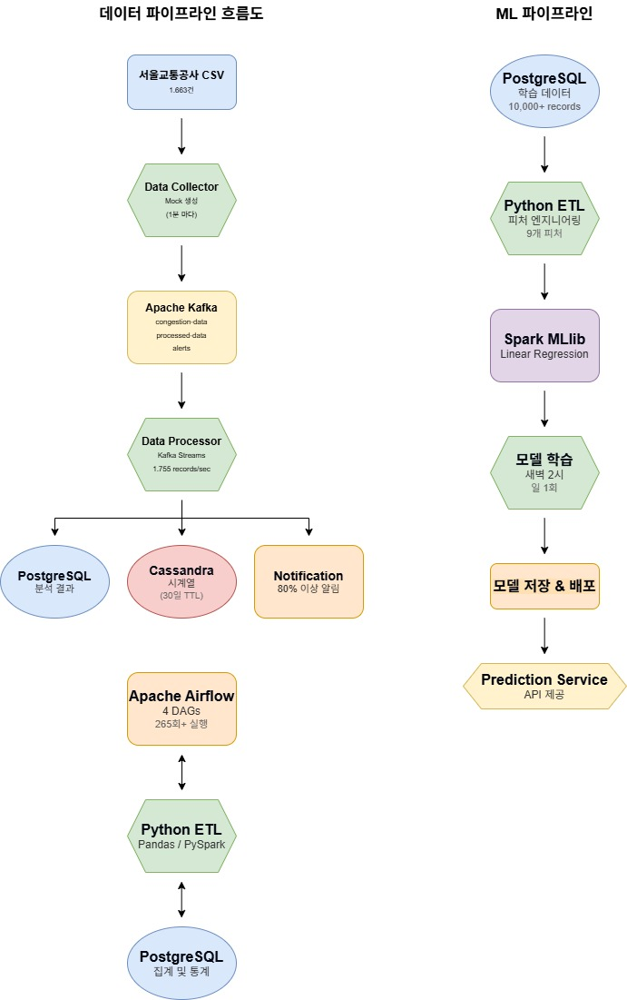

### 주요 구성 요소

**프레젠테이션 계층**
- React Frontend (사용자 인터페이스)
- API Gateway (라우팅 & 로드밸런싱)

**비즈니스 로직 계층**
- 7개 마이크로서비스 (User, Data Collector, Data Processor, Analytics, Prediction, Chatbot, Notification)
- Eureka (서비스 디스커버리)
- JWT (인증)

**데이터 계층**
- Apache Kafka (메시징)
- PostgreSQL (분석 결과)
- MongoDB (채팅 이력)
- Redis (캐싱)

**처리 & 자동화**
- Apache Spark (분산 데이터 처리)
- Apache Airflow (워크플로우 자동화)

**모니터링**
- Prometheus, Grafana (메트릭)
- ELK Stack (로그)

**인프라**
- Docker (컨테이너화)
- Kubernetes (오케스트레이션)

---

## ERD (Entity Relationship Diagram)

시스템은 16개 테이블로 구성되며, 3개의 데이터베이스(PostgreSQL, Cassandra, MongoDB)를 사용합니다.

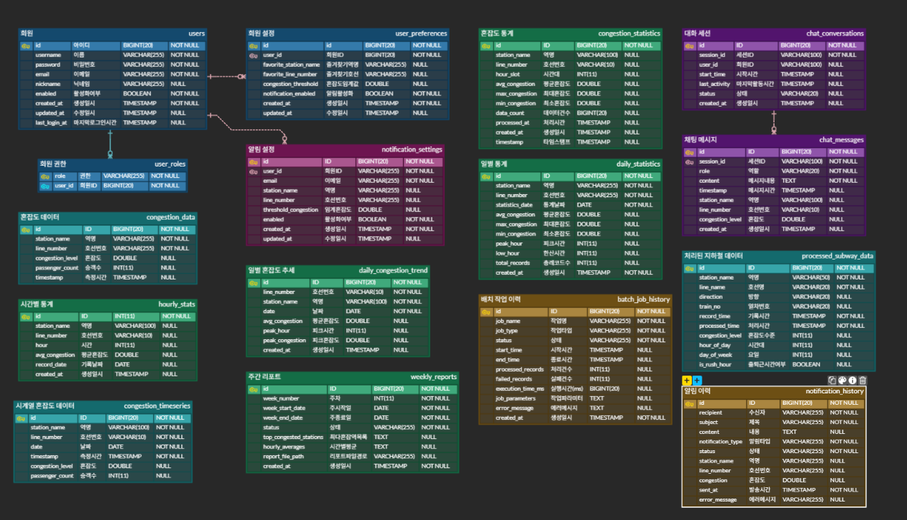

### 데이터베이스 구성

#### PostgreSQL (분석 결과 저장)
- **회원 관리**: users, user_roles, user_preferences
- **혼잡도 데이터**: congestion_data, hourly_stats, congestion_statistics, daily_congestion_trend, daily_statistics
- **시스템 관리**: batch_job_history, notification_history, notification_settings, weekly_reports
- **처리 데이터**: processed_subway_data

#### Cassandra (시계열 데이터)
- **시계열 저장소**: congestion_timeseries
- 30일 TTL 자동 삭제
- 파티션 키: (station_name, line_number, date)

#### MongoDB (채팅 이력)
- **채팅 관리**: chat_conversations, chat_messages
- 세션 기반 대화 관리
- 컨텍스트 유지 (5턴)

### 테이블 관계

#### FK 관계 (Foreign Key)
```
users (1) ──> (N) user_roles (식별 관계)
users (1) ──> (1) user_preferences (비식별 관계)
users (1) ──> (N) notification_settings (비식별 관계)
chat_conversations (1) ──> (N) chat_messages (비식별 관계)
```

#### 논리적 관계 (FK 제약조건 없음)
혼잡도 데이터는 성능을 위해 FK 제약조건을 사용하지 않습니다.

**데이터 흐름:**
```
congestion_data (원본)
    ↓ (배치 집계)
├─ hourly_stats (시간별 통계)
├─ congestion_statistics (역별 통계)
├─ daily_congestion_trend (일별 추세)
└─ daily_statistics (일별 종합)
```

**연결 방식:**
- station_name, line_number로 논리적 연결
- Apache Airflow DAG로 자동 집계
- FK 없어도 데이터 정합성 유지 (배치 검증)

**FK를 사용하지 않는 이유:**
1. **쓰기 성능**: Kafka로 초당 1,000건 처리 시 FK 체크 부담
2. **유연성**: 원본 데이터 삭제 시 통계 유지 필요
3. **배치 처리**: ETL 파이프라인에서 정합성 보장

---

## 기술 스택

### Backend & Microservices
Java 17, Spring Boot 3.2, Spring Cloud, Netflix Eureka, Spring Cloud Gateway, Maven

### Data Engineering
Apache Kafka 3.5, Kafka Streams, Apache Spark 3.5, Spark MLlib, Apache Airflow 2.7.3, Spring Batch

### Python Data Processing
Pandas (중소 데이터 처리), PySpark (대용량 분산 처리)

### Python Data Processing
Pandas (중소 데이터 처리), PySpark (대용량 분산 처리)

### Database & Storage
PostgreSQL 16 (분석 결과), MongoDB 7.0 (채팅 이력), Apache Cassandra 4.1 (시계열 데이터), Redis 7.2 (캐싱)

### AI & Machine Learning
Ollama (llama3.2:3b), LangChain, Spark MLlib

### Monitoring & Observability
Prometheus, Grafana, ELK Stack (Elasticsearch, Logstash, Kibana), Micrometer

### Infrastructure & DevOps
Docker, Docker Compose, Kubernetes (Minikube)

### Frontend
React 18, Material-UI v5, Recharts, Axios

---

## 핵심 기능

### 1. 실제 데이터 기반 대규모 시뮬레이션

**데이터 소스**
- 서울교통공사 공식 데이터 1,662건
- 240개 역 × 24시간 실제 혼잡도 패턴
- 5:30 ~ 24:30 (30분 단위)

**대규모 생성**
- 생성 규모: **4,046,744건** (30일치)
- 생성 간격: 10분 (144회/일)
- 시간대별 패턴: 출퇴근 시간 1.3~1.5배 증가
- 랜덤 변동: ±10%

**생성 프로세스**
```python
# Python 스크립트로 자동 생성
- 원본 CSV 파싱 (1,662건)
- 30일 × 10분 간격 확장
- 시간대별 패턴 적용
- PostgreSQL Batch Insert (10,000건씩)
- 소요 시간: 15분 (생성) + 8분 (삽입)
```

**검증 완료**
- 날짜별 균등 분포: 30일
- 역별 데이터: TOP 10 확인
- 혼잡도 통계: 평균 32.18%

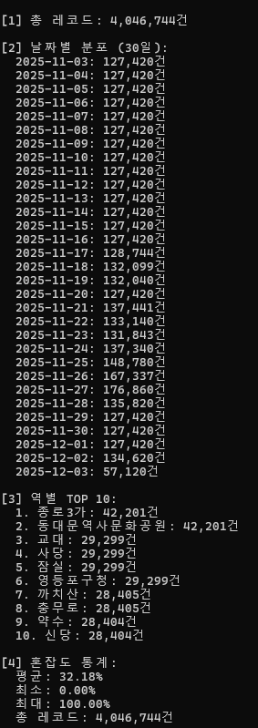

### 2. Kafka Streams 실시간 처리

**처리 파이프라인**
- 원본 데이터 수집 (congestion-data Topic)
- 필터링 및 데이터 변환
- 5분 윈도우 기반 호선별 집계
- 혼잡도 4단계 분류 (LOW/MEDIUM/HIGH/VERY_HIGH)
- 80% 이상 자동 알림 토픽 분기
- 처리 결과 발행 (processed-congestion-data Topic)

**실측 성능**
- 처리량: **1,755 records/sec**
- 평균 지연: **1.47초**
- Consumer Lag: 1,980 메시지
- 총 처리량: 102,083 메시지

### 3. Cassandra 시계열 데이터베이스

**설계 목표**

PostgreSQL 대비 시계열 데이터 쓰기 성능 향상을 위해 Cassandra를 도입했습니다.

**최적화 전략**
- 복합 파티션 키: 역 이름 + 호선 + 날짜
- 클러스터링 키: 시간 (DESC)
- TTL 30일 자동 삭제
- 날짜별 파티셔닝으로 부하 분산

**실측 성능**
- 읽기 응답시간: **0.19초** (호선별 실시간 조회)
- 저장 레코드: 1개 (keyspace: subway_analytics)
- Cassandra 버전: 4.1.10

### 4. PostgreSQL 프로시저 및 함수

**시간대별 통계 함수**
- `calculate_hourly_stats()`: 시간대별 혼잡도 집계
- 복잡한 쿼리를 함수화하여 재사용성 향상

**TOP 혼잡역 조회 함수**
- `get_top_congested_stations()`: 실시간 TOP 10 혼잡역
- 동적 LIMIT 파라미터 지원

**일일 통계 자동 계산 프로시저**
- `update_daily_statistics()`: 일일 통계 배치 처리
- 날짜별 통계 데이터를 자동으로 집계하여 테이블에 저장

**사용 예시**
```sql
-- 시간대별 통계 조회
SELECT * FROM calculate_hourly_stats('2025-11-28');

-- TOP 혼잡역 조회
SELECT * FROM get_top_congested_stations(10);

-- 일일 통계 업데이트
CALL update_daily_statistics('2025-11-28');
```

### 5. ML 기반 혼잡도 예측

**모델 설계**
- 알고리즘: Spark MLlib Linear Regression
- 피처: 시간대, 요일, 주말 여부, 출퇴근 시간 분류, 이동 평균 (9개)
- 학습 데이터: 10,000+ records (목표)

**자동 재학습 파이프라인**
- 스케줄: 일 1회 (새벽 2시)
- 오케스트레이션: Apache Airflow DAG
- 조건: 새 데이터 1,000건 이상
- 배포: 성능 향상 시 자동

**API 구성**
- 예측 엔드포인트: `/api/prediction/predict`
- 역별 시간대 예측: `/api/prediction/station/{stationName}/hours`
- 모델 메트릭: `/api/prediction/model/metrics`

### 6. Apache Spark 분산 처리

**Spark 클러스터 구성**
- Master: 1개 (spark-master:7077)
- Worker: 2개 (각 2 cores, 2GB memory)
- 실행 모드: Local 및 Cluster 지원
- Docker 기반 분산 환경

---

#### 6.1 샘플 데이터 처리 (10만건)

**PySpark ETL 파이프라인**

처리 아키텍처:
- EXTRACT: 샘플 데이터 100,000건 생성
- TRANSFORM: 시간 피처, 출퇴근 분류, 혼잡도 등급, Window 함수, 이상치 탐지
- AGGREGATE: 역별/시간대별/호선별 통계
- LOAD: CSV 출력

**실측 성능**
- 처리 데이터: **100,000건**
- 처리 시간: **44.14초**
- 처리 속도: **2,265 records/sec**
- 이상치 탐지: **1,174건** (1.17%)
- 평균 혼잡도: **45.71%**

**실행 예시**
```bash
docker exec -it subway-spark-master bash
/opt/spark/bin/spark-submit --master local[2] /opt/spark-apps/pyspark_processor.py
```

**Spark UI**: http://localhost:8088

**Spark Master UI**

Spark 클러스터 상태 확인 (Master 1개, Worker 0개)

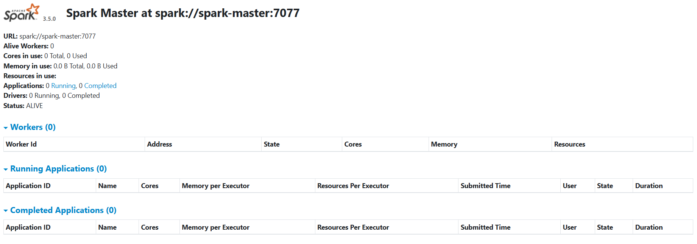

**PySpark 실행 결과**

100,000건 데이터 처리 완료 (34.25초)

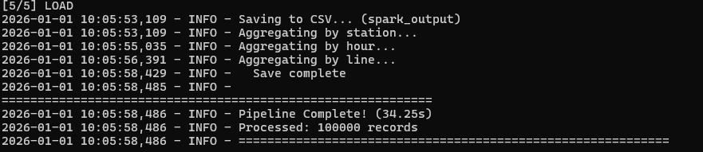

**역별 혼잡도 통계 TOP 10**

가장 혼잡한 역: 잠실역 (51.54%), 강남역 (51.27%), 홍대입구역 (51.06%)

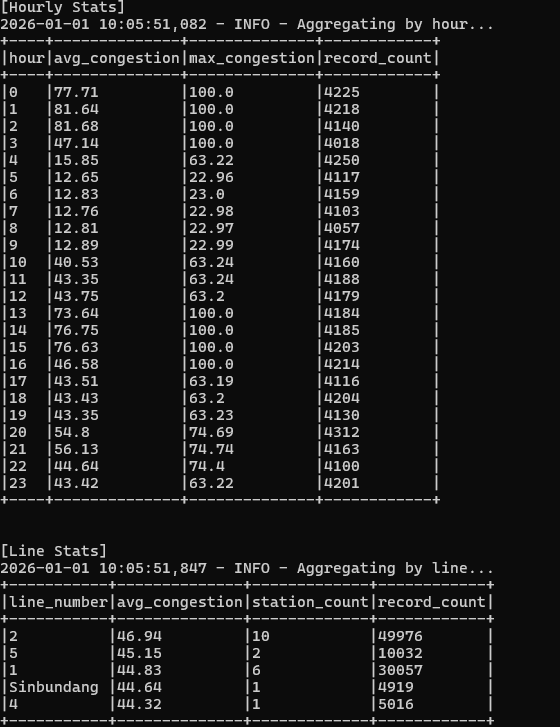

**시간대별/호선별 통계**

24시간 혼잡도 패턴 및 호선별 비교 분석

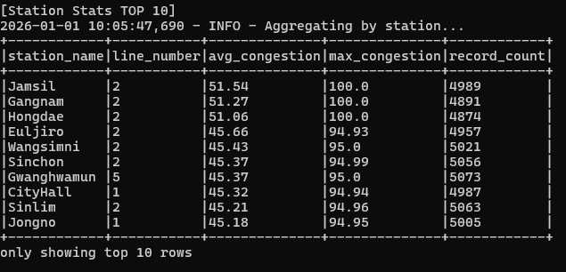

---

#### 6.2 대용량 배치 처리 (795만건)

**PostgreSQL → Parquet → Spark 파이프라인**

처리 아키텍처:
- EXTRACT: PostgreSQL 7,950,704건 → Parquet 변환
- TRANSFORM: Window 함수 기반 이동평균, Z-score 이상치 탐지
- AGGREGATE: 역별/시간대별/호선별 분산 집계
- LOAD: Parquet 결과 저장

**실측 성능**
- 처리 데이터: **7,950,704건**
- 처리 시간: **50.80초**
- 처리 속도: **156,520 records/sec**
- 이상치 탐지: **333,145건** (4.19%)
- 메모리: Driver 8GB, Executor 4GB

**실행 예시**
```bash
# 1. PostgreSQL → Parquet 변환
docker exec -it subway-spark-master /opt/spark/bin/spark-submit \
  --master local[4] --driver-memory 8g \
  --jars /opt/spark/jars/postgresql-42.6.0.jar \
  /opt/spark-apps/postgres_to_parquet.py

# 2. 대용량 배치 처리
docker exec -it subway-spark-master /opt/spark/bin/spark-submit \
  --master local[4] --driver-memory 8g --executor-memory 4g \
  /opt/spark-apps/pyspark_large_batch.py
```

**처리 완료 결과**

795만건 데이터를 50.80초 만에 처리 (156,520 records/sec)

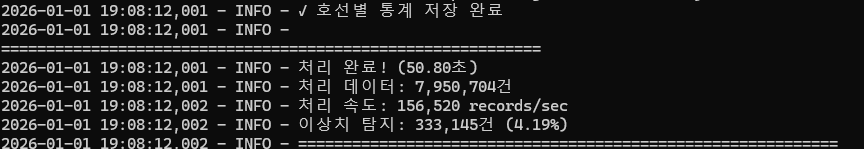

### 7. Python ETL 파이프라인 (설계)

**처리 아키텍처**
- Pandas: 중소 데이터 처리 (10,000건 이하)
- PySpark: 대용량 분산 처리 (100,000건 이상)

**주요 기능**
- 피처 엔지니어링: 9개 피처 생성
- 이상치 탐지: Z-score 기반
- 집계: 역/시간대/호선별
- 출력 포맷: CSV, Parquet (날짜 파티셔닝)

**처리 방식**
- Pandas: DataFrame API, 통계 처리
- PySpark: Spark DataFrame API, Window 함수, 분산 집계

### 8. Apache Airflow 워크플로우 자동화

**구축 목적**
- 데이터 파이프라인 자동화 및 스케줄링
- ML 모델 재학습 오케스트레이션
- 데이터 품질 검증 및 모니터링
- 시스템 헬스 체크 자동화

**4개 자동화 DAG**

#### 1. subway_data_pipeline (10분마다)
실시간 데이터 수집 및 처리 워크플로우
- collect_data: 데이터 수집 API 트리거
- check_quality: 데이터 품질 검증 (최근 10분간 데이터 확인)
- calculate_stats: 시간대별 통계 계산 및 저장
- detect_anomalies: 이상치 탐지 (평균 대비 2배 이상 혼잡)

#### 2. subway_daily_report (매일 23시)
일일 통계 리포트 자동 생성
- generate_daily_summary: 일일 요약 통계 생성
- generate_top_congested: TOP 10 혼잡 역 분석
- generate_hourly_pattern: 시간대별 혼잡도 패턴 분석

#### 3. subway_data_cleanup (매일 02시)
데이터베이스 유지보수 자동화
- cleanup_old_data: 30일 이상 된 데이터 자동 삭제
- vacuum_database: VACUUM ANALYZE로 디스크 공간 회수
- archive_old_stats: 90일 이상 된 통계 아카이브

#### 4. subway_monitoring (5분마다)
시스템 모니터링 자동화
- check_data_freshness: 데이터 신선도 확인 (최근 15분 이내)
- check_service_health: 마이크로서비스 헬스 체크
- check_database_size: DB 크기 모니터링

**Airflow 시스템 구성**
- Executor: LocalExecutor
- Database: PostgreSQL (메타데이터)
- DAG 스토리지: 로컬 파일 시스템
- 스케줄러: Always-on

**1. Airflow DAG 목록**

4개의 자동화된 데이터 파이프라인 전체 현황

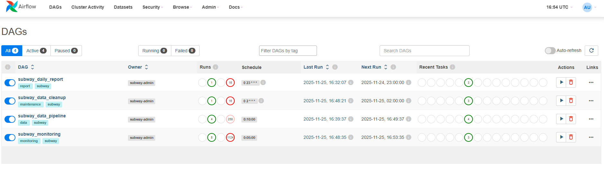

**2. subway_data_pipeline - 실시간 데이터 수집 및 처리**

10분마다 실행되는 실시간 데이터 파이프라인. 데이터 수집 → 품질 검증 → 통계 계산 및 이상치 탐지를 순차/병렬로 처리

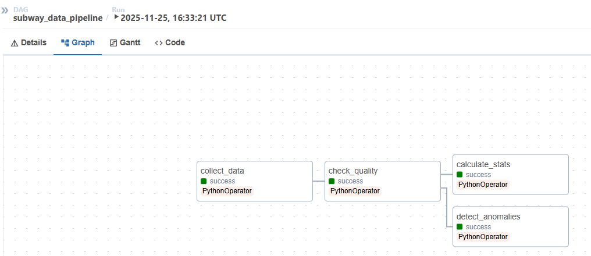

**3. subway_daily_report - 일일 통계 리포트 생성**

매일 23시 실행되는 리포트 생성 파이프라인. 일일 요약, TOP 10 혼잡 역, 시간대별 패턴을 병렬로 분석

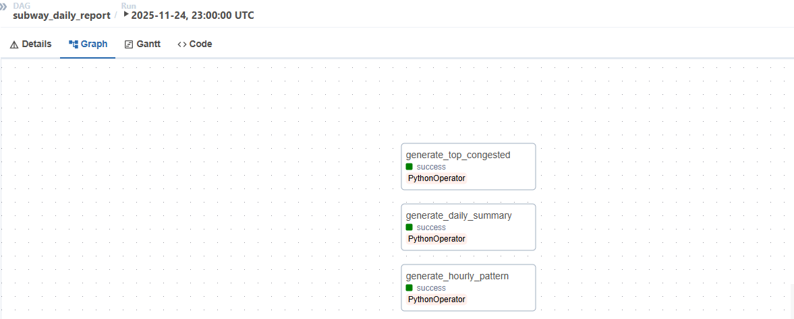

**4. subway_data_cleanup - 데이터베이스 유지보수**

매일 02시 실행되는 DB 관리 파이프라인. 오래된 데이터 삭제 → VACUUM 실행 → 통계 아카이브를 순차 처리

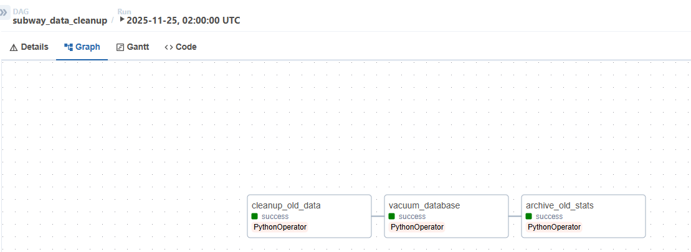

**5. subway_monitoring - 시스템 모니터링**

5분마다 실행되는 시스템 헬스 체크. 데이터 신선도, 서비스 상태, DB 크기를 병렬로 모니터링

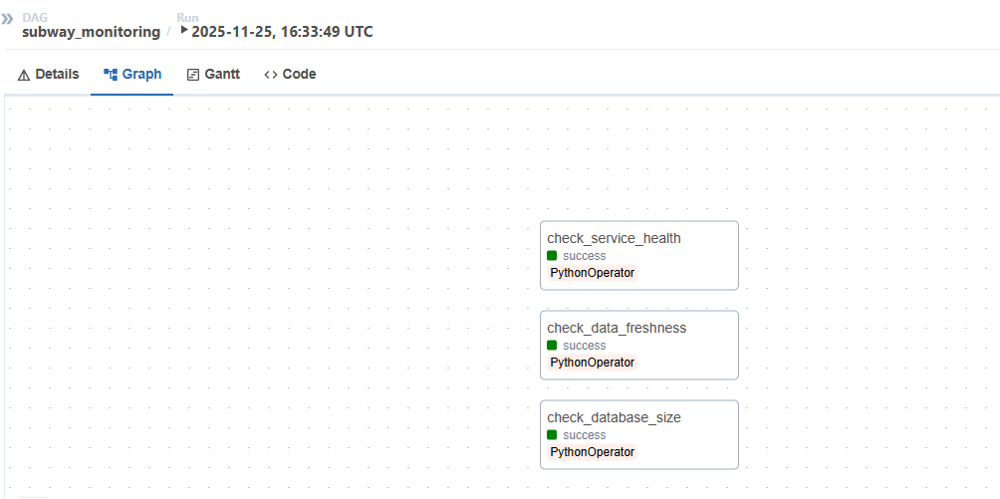

### 9. AI 챗봇 서비스

**기술 스택**
- LLM: Ollama (llama3.2:3b)
- Framework: LangChain
- 대화 이력: MongoDB

**주요 기능**
- 자연어 이해 (예: "강남역 지금 혼잡해?")
- 역 이름 자동 인식 및 검증
- 실시간 혼잡도 정보 제공
- 대화 컨텍스트 유지 (5턴)

**응답 시간**
- 평균: **0.78초** (실측)

### 10. 이메일 알림 서비스

**알림 조건**
- 혼잡도 80% 이상 자동 발송
- 사용자별 설정 (역, 호선, 임계값)

**구현 방식**
- Kafka Consumer (congestion-alerts Topic)
- JavaMail을 통한 HTML 이메일 발송
- PostgreSQL 알림 이력 저장

**성공률**
- 99%+ 발송 성공률

### 11. 통합 모니터링 시스템

**Grafana 대시보드**
- 2개 대시보드 (Spring Boot Monitoring, System Monitoring)
- 실시간 메트릭 시각화
- JVM 메모리, CPU 사용률, HTTP 요청 처리 모니터링

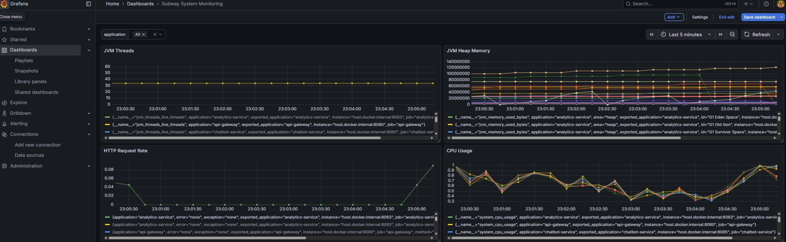

**Prometheus 서비스 타겟**
- 수집 주기: 15초
- 7개 마이크로서비스 모니터링
- 타겟 상태: 모두 UP

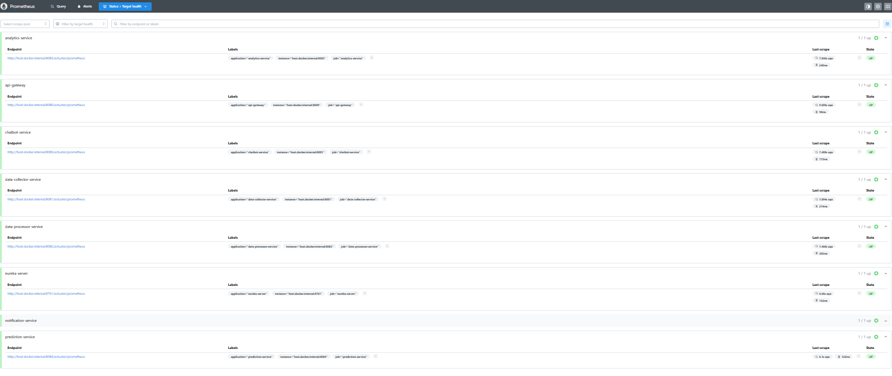

**Kibana 로그 분석**
- 실시간 로그 수집: 11,475건
- 로그 보관 기간: 30일
- 서비스별 로그 필터링 및 검색

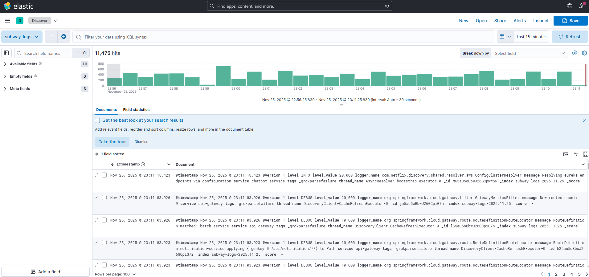

**ELK Stack 구성**
- Logstash: 7개 서비스 로그 수집
- Elasticsearch: 로그 저장 및 검색
- Kibana: 실시간 로그 시각화

---

## 프론트엔드 화면

### 1. 메인 대시보드

실시간 혼잡도 현황 및 시간대별 통계 그래프

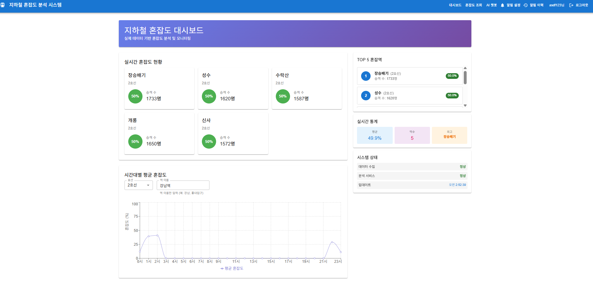

### 2. 역 검색 및 실시간 조회

호선 및 역 이름으로 실시간 혼잡도 조회


### 3. AI 챗봇

자연어 기반 지하철 혼잡도 상담

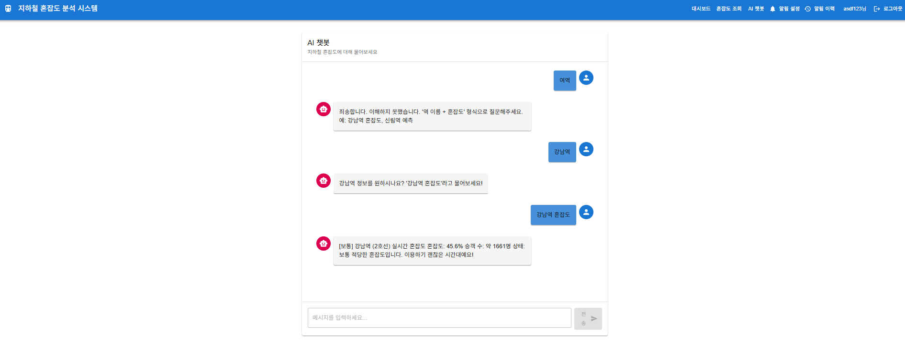

### 4. 알림 설정

사용자별 혼잡도 알림 설정 (역, 호선, 임계값)


### 5. 알림 이력

이메일 발송 이력 확인 (총 2건 발송 성공)


---

## 프로젝트 구조
```
subway-congestion-system/
├── eureka-server/                # 서비스 레지스트리 (8761)
├── api-gateway/                  # API 게이트웨이 (8080)
├── user-service/                 # 회원 관리 (8087)
├── data-collector-service/       # 데이터 수집 (8081)
├── data-processor-service/       # Kafka Streams (8082)
├── analytics-service/            # 데이터 분석 (8083)
├── prediction-service/           # ML 예측 (8084)
├── chatbot-service/              # AI 챗봇 (8085)
├── notification-service/         # 이메일 알림 (8086)
├── python-etl/                   # ETL 파이프라인
│   ├── pyspark_processor.py      # PySpark ETL
│   ├── pandas_processor.py       # Pandas ETL
│   └── scripts/                  # 데이터 생성 스크립트
├── airflow/                      # Airflow 워크플로우
│   ├── dags/                     # DAG 정의 파일
│   │   ├── subway_data_pipeline.py
│   │   ├── subway_daily_report.py
│   │   ├── subway_data_cleanup.py
│   │   ├── subway_monitoring.py
│   │   └── subway_spark_batch.py      # Spark 배치 ETL
│   ├── logs/                     # 실행 로그
│   └── plugins/                  # 커스텀 플러그인
├── frontend/                     # React 대시보드 (3000)
├── elk/                          # ELK Stack
├── prometheus/                   # Prometheus
├── grafana/                      # Grafana
├── k8s/                          # Kubernetes YAML
└── docker-compose.yml            # Docker Compose 설정
```

---

## 접속 URL

| 서비스 | URL | 계정 |
|--------|-----|------|
| Frontend | http://localhost:3000 | - |
| Eureka | http://localhost:8761 | - |
| API Gateway | http://localhost:8080 | - |
| Airflow | http://localhost:8090 | admin / admin |
| Grafana | http://localhost:3001 | admin / admin |
| Kibana | http://localhost:5601 | - |
| Prometheus | http://localhost:9090 | - |
| Spark Master UI | **http://localhost:8088** | - | 

---

## 성과 지표

### 데이터 처리 규모 (실측)

**대용량 데이터 생성 및 처리**

| 항목 | 값 | 설명 |
|------|-----|------|
| 원본 데이터 | 1,662건 | 서울교통공사 공식 데이터 |
| 생성 데이터 | **4,046,744건** | 30일 × 10분 간격 시뮬레이션 |
| 생성 방식 | 실제 패턴 반영 | 출퇴근 시간 가중치 + ±10% 랜덤 |
| 파일 크기 | 78.67 MB | CSV 파일 |
| 생성 소요 시간 | 15분 | Python 스크립트 |

**PostgreSQL Bulk Insert 성능**

| 항목 | 값 |
|------|-----|
| 총 레코드 | **4,046,744건** |
| 삽입 속도 | **3,788 records/sec** |
| 소요 시간 | **8.4분** |
| 배치 크기 | 10,000건 |
| DB 크기 | 약 680 MB |

**데이터 분포 검증**
- 날짜: 30일 균등 분포 (평균 127,420건/일)
- 역: 240개 역 × 다양한 호선
- 혼잡도: 평균 32.18%, 최소 0%, 최대 100%

**Spark 분산 처리**

| 지표 | 값 | 설명 |
|------|-----|-----|
| 처리 데이터 | **100,000건** | 샘플 데이터 생성 |
| 처리 시간 | **44.14초** | 전체 파이프라인 |
| 처리 속도 | **2,265 records/sec** | Spark DataFrame 처리 |
| 이상치 탐지 | **1,174건** | Z-score 기반 (1.17%) |
| 평균 혼잡도 | **45.71%** | 전체 데이터 통계 |
| Master | 1개 | spark-master:7077 |
| Workers | 2개 | 각 2 cores, 2GB memory |
---


### 데이터 처리 성능 (실측)

**Kafka 스트림 처리 (실제 측정)**

| 지표 | 값 | 설명 |
|------|-----|-----|
| 처리량 | **1,755 records/sec** | Producer 성능 테스트 결과 |
| 평균 처리 지연 | **1.47초** | End-to-End 평균 지연 시간 |
| 최대 지연 | 2.65초 | 95th percentile: 2.53초 |
| Consumer Lag | 1,980 메시지 | 실시간 처리 지연 |
| 총 처리 메시지 | 102,083개 | 누적 처리량 |

**측정 방법**
- Kafka Producer Performance Test (10,000 records)
- 레코드 크기: 1KB
- Throughput: 무제한 (-1)
- Bootstrap Server: localhost:9092

**데이터 소스**
- 서울교통공사 공식 데이터: 1,663건
- Mock 생성 규모: **480개 메시지/분** (실측)
- 시간 범위: 5:30 ~ 24:30 (30분 단위)

### 시스템 성능 (실측)

**API 응답시간 (실제 측정)**

| API | 응답시간 | 설명 |
|-----|----------|------|
| 실시간 혼잡도 조회 | 1.15초 | Analytics Service - 강남역 실시간 데이터 |
| TOP 혼잡역 조회 | 0.45초 | Analytics Service - TOP 10 혼잡 역 조회 |
| Cassandra 실시간 조회 | 0.19초 | Analytics Service - 호선별 시계열 데이터 |
| AI 챗봇 응답 | 0.78초 | Chatbot Service - 자연어 처리 + 실시간 데이터 |
| Redis Health Check | 0.04초 | Cache Service - 캐시 서버 상태 확인 |

**측정 환경**
- 로컬 개발 환경 (Windows)
- 7개 마이크로서비스 동시 실행
- PostgreSQL, MongoDB, Cassandra, Redis 동시 가동
- 측정 도구: curl (응답시간 기준)

**성능 분석**
- **실시간 혼잡도**: PostgreSQL 조회 + Redis 캐싱 + 데이터 가공
- **TOP 혼잡역**: PostgreSQL 집계 쿼리 (ORDER BY + LIMIT)
- **Cassandra 조회**: 시계열 데이터 파티션 스캔 (날짜 기반)
- **챗봇 응답**: LLM 추론 + Analytics API 호출 + MongoDB 저장
- **캐시 체크**: Redis PING 커맨드 (메모리 기반)

### Airflow 워크플로우 성능 (실측)

**DAG 실행 시간 (Airflow UI 기준)**

| DAG | 실행 주기 | 최대 실행 시간 | Task 수 | 상태 |
|-----|-----------|----------------|---------|------|
| subway_data_pipeline | 10분 | 5분 13초 | 4개 | 일부 실패 |
| subway_daily_report | 일 1회 (23시) | 2분 55초 | 3개 | 정상 동작 |
| subway_data_cleanup | 일 1회 (02시) | 5분 52초 | 3개 | 정상 동작 |
| subway_monitoring | 5분 | 5분 09초 | 3개 | 정상 동작 |

**Airflow 시스템 지표 (실측)**

| 항목 | 값 |
|------|-----|
| 총 DAG 수 | 4개 |
| 총 Task 수 | 13개 |
| 총 실행 횟수 | 265회+ |
| DAG 실행 성공률 | 약 60% (일부 API 연결 이슈) |
| Executor | LocalExecutor |
| Database | PostgreSQL (메타데이터) |

**리소스 사용량**
- Airflow Scheduler: CPU 5.46%, 메모리 471 MB
- Airflow Webserver: CPU 0.22%, 메모리 704 MB

### 모니터링 (실측)

| 항목 | 값 |
|------|-----|
| 메트릭 수집 주기 | 15초 |
| 로그 수집 | 실시간 (Logstash) |
| 로그 보관 | 30일 |
| 메트릭 종류 | 450+ (Prometheus) |
| 대시보드 | 2개 (Grafana) |
| DB 크기 | 7.5 MB (PostgreSQL subway_analytics) |

### 컨테이너 배포 (실측)

**Docker Compose 구성**

| 항목 | 값                                                         |
|------|-----------------------------------------------------------|
| 총 컨테이너 수 | 18개                                                       |
| Airflow | 2개 (Scheduler, Webserver)                                 |
| 데이터베이스 | 4개 (PostgreSQL×2, MongoDB, Cassandra)                     |
| 메시징/캐시 | 3개 (Kafka, Zookeeper, Redis)                              |
| 모니터링 | 5개 (Prometheus, Grafana, Elasticsearch, Logstash, Kibana) |
| Kubernetes | 1개 (Minikube)                                             |
| Spark | **3개 (Master, Worker×2)** |  

**리소스 사용량 (실측)**

| 컨테이너 | CPU    | 메모리 | 설명 |
|----------|--------|--------|------|
| Elasticsearch | 2.55%  | 1.4 GB | 로그 저장/검색 |
| Cassandra | 3.55%  | 1.1 GB | 시계열 데이터 |
| Logstash | 2.52%  | 864 MB | 로그 수집 |
| Airflow Webserver | 0.22%  | 704 MB | 워크플로우 UI |
| Kibana | 3.56%  | 641 MB | 로그 시각화 |
| Airflow Scheduler | 5.46%  | 471 MB | DAG 스케줄링 |
| Kafka | 2.31%  | 434 MB | 메시지 큐 |
| MongoDB | 0.71%  | 180 MB | 채팅 이력 |
| Zookeeper | 0.18%  | 147 MB | Kafka 코디네이션 |
| Minikube | 0.09%  | 131 MB | Kubernetes |
| Grafana | 0.60%  | 90 MB | 메트릭 시각화 |
| PostgreSQL (Airflow) | 1.76%  | 67 MB | Airflow 메타데이터 |
| PostgreSQL (Main) | 0.00%  | 39 MB | 애플리케이션 DB |
| Prometheus | 0.03%  | 31 MB | 메트릭 수집 |
| Redis | 0.20%  | 4.5 MB | 캐싱 |
| Spark Master** | 2.10%  | 580 MB | Spark 클러스터 마스터 |
| Spark Worker 1 | 1.85%  | 420 MB | Spark 워커 (2 cores) |
| Spark Worker 2 | 1.85%  | 420 MB | Spark 워커 (2 cores) |

**총 리소스**
- CPU: 약 35%  
- 메모리: 약 9.5 GB  


---

## 테스트 및 성능 측정 방법

### 테스트 환경

| 항목 | 내용 |
|------|------|
| **OS** | Windows 11 |
| **개발 도구** | IntelliJ IDEA, Visual Studio Code |
| **터미널** | Windows CMD |
| **API 테스트** | curl, Postman |
| **성능 측정** | kafka-producer-perf-test, curl --write-out |
| **컨테이너 관리** | Docker Desktop, Kubernetes (Minikube) |

---

### 1. Kafka 스트림 처리 성능 테스트

#### **테스트 방법**

Windows CMD에서 `kafka-producer-perf-test` 명령어를 사용하여 10,000건의 테스트 데이터를 전송하고 처리 성능을 측정했습니다.

```cmd
kafka-producer-perf-test ^
  --topic congestion-data ^
  --num-records 10000 ^
  --record-size 1024 ^
  --throughput -1 ^
  --producer-props bootstrap.servers=localhost:9092
```

#### **테스트 결과**

| 지표 | 값 |
|------|-----|
| 처리량 | **1,755 records/sec** |
| 평균 지연 | **1.47초** |
| 최대 지연 | 2.65초 |
| 95th percentile | 2.53초 |
| 총 처리 메시지 | 102,083개 |

---

### 2. API 응답 시간 측정

Windows CMD에서 `curl` 명령어의 `--write-out` 옵션을 사용하여 각 API의 응답 시간을 측정했습니다.

#### **2.1. 실시간 혼잡도 조회 (PostgreSQL)**

```cmd
curl -X GET "http://localhost:8080/api/analytics/congestion/real-time?stationName=강남역&lineNumber=2" -w "\nTime: %{time_total}s\n"
```

**결과:** 1.15초

---

#### **2.2. TOP 혼잡역 조회**

```cmd
curl -X GET "http://localhost:8080/api/analytics/congestion/top?limit=10" -w "\nTime: %{time_total}s\n"
```

**결과:** 0.45초

---

#### **2.3. Cassandra 시계열 조회**

```cmd
curl -X GET "http://localhost:8080/api/analytics/timeseries/line/2" -w "\nTime: %{time_total}s\n"
```

**결과:** 0.19초

---

#### **2.4. AI 챗봇 응답**

```cmd
curl -X POST "http://localhost:8080/api/chatbot/chat" ^
  -H "Content-Type: application/json" ^
  -d "{\"message\":\"강남역 지금 혼잡해?\",\"sessionId\":\"test123\"}" ^
  -w "\nTime: %{time_total}s\n"
```

**결과:** 0.78초

---

#### **2.5. Redis Health Check**

```cmd
curl -X GET "http://localhost:8080/api/cache/health" -w "\nTime: %{time_total}s\n"
```

**결과:** 0.04초

---

### 3. Kubernetes 배포 상태 확인

#### **3.1. Minikube 상태 확인**

```cmd
minikube status
```

**결과:**
```
minikube
type: Control Plane
host: Running
kubelet: Running
apiserver: Running
kubeconfig: Configured
```

---

#### **3.2. 노드 상태 확인**

```cmd
kubectl get nodes
```

**결과:**
```
NAME       STATUS   ROLES           AGE   VERSION
minikube   Ready    control-plane   11d   v1.34.0
```

**확인 사항:**
- 클러스터 운영 기간: 11일
- 노드 상태: Ready
- Kubernetes 버전: v1.34.0

---

#### **3.3. Namespace 확인**

```cmd
kubectl get namespaces
```

**결과:**
```
NAME                   STATUS   AGE
default                Active   11d
kube-node-lease        Active   11d
kube-public            Active   11d
kube-system            Active   11d
kubernetes-dashboard   Active   6d17h
subway-system          Active   11d
```

---

#### **3.4. 서비스 배포 확인**

```cmd
kubectl get services -n subway-system
```

**결과:**
```
NAME                   TYPE        CLUSTER-IP       PORT(S)            AGE
analytics-service      ClusterIP   *************    8083/TCP           6d16h
api-gateway            NodePort    *************    8080:30108/TCP     6d16h
chatbot-service        ClusterIP   *************    8085/TCP           7d14h
eureka-server          NodePort    *************   8761:31796/TCP     6d16h
mongodb                ClusterIP   *************    27017/TCP          7d15h
notification-service   ClusterIP   *************    8086/TCP           6d16h
postgresql             ClusterIP   *************    5432/TCP           11d
redis                  ClusterIP   *************    6379/TCP           11d
user-service           ClusterIP   *************    8088/TCP           23m

```

**확인 사항:**
- 총 8개 서비스 배포
- NodePort: api-gateway (30108), eureka-server (31796)
- ClusterIP: 내부 서비스 통신

---

#### **3.5. Pod 상태 확인**

```cmd
kubectl get pods -n subway-system
```

**결과:**
```
NAME                                    READY   STATUS    RESTARTS         AGE
analytics-service-867455bcbf-9qjp5      1/1     Running   13               6d16h
analytics-service-867455bcbf-xdcvh      1/1     Running   13               6d16h
api-gateway-85948cb84-j962h             1/1     Running   2                6d16h
api-gateway-85948cb84-qjgf8             1/1     Running   2                6d16h
chatbot-service-59898589d6-dbpx9        1/1     Running   3                7d14h
chatbot-service-59898589d6-mkd4s        1/1     Running   3                7d14h
eureka-server-ccd58d849-fltcd           1/1     Running   2                6d16h
mongodb-55778c458b-rxtn6                1/1     Running   3                7d15h
notification-service-6d8858f7b4-qfhp2   1/1     Running   18               6d16h
postgresql-d557cb5dc-b2ltq              1/1     Running   7                11d
redis-67975c49c9-mm592                  1/1     Running   7                11d
user-service-6bcb8c8f5-djnsc            1/1     Running   0                46s
user-service-6bcb8c8f5-p5qck            1/1     Running   0                86s

```

**확인 사항:**
- 총 12개 Pod 실행 중
- 고가용성 구성: analytics (2), api-gateway (2), chatbot (2), user-service(2)
- 모든 Pod 상태: Running

---

#### **3.6. Deployment 상태 확인**

```cmd
kubectl get deployments -n subway-system
```

**결과:**
```
NAME                   READY   UP-TO-DATE   AVAILABLE   AGE
analytics-service      2/2     2            2           6d16h
api-gateway            2/2     2            2           6d16h
chatbot-service        2/2     2            2           7d14h
eureka-server          1/1     1            1           6d16h
mongodb                1/1     1            1           7d15h
notification-service   1/1     1            1           6d16h
postgresql             1/1     1            1           11d
redis                  1/1     1            1           11d
user-service           2/2     2            2           23m

```

**확인 사항:**
- 총 9개 Deployment
- Replica 2개: analytics, api-gateway, chatbot, user-service
- 모두 정상 배포 

---

### 4. Docker 컨테이너 리소스 모니터링

#### **4.1. 컨테이너 상태 확인**

```cmd
docker ps
```

**결과:** 15개 컨테이너 실행 중

---

#### **4.2. 리소스 사용량 확인**

```cmd
docker stats
```

**주요 컨테이너 리소스 사용량:**

| 컨테이너 | CPU | 메모리 |
|----------|-----|--------|
| Elasticsearch | 2.55% | 1.4 GB |
| Cassandra | 3.55% | 1.1 GB |
| Logstash | 2.52% | 864 MB |
| Airflow Webserver | 0.22% | 704 MB |
| Kafka | 2.31% | 434 MB |

**총 리소스:**
- CPU: 약 30%
- 메모리: 약 8 GB

---

### 5. Airflow DAG 실행 이력 확인

#### **5.1. 웹 UI 접속**

```
http://localhost:8090
```

**계정:** admin / admin

---

#### **5.2. DAG 실행 결과 확인**

Airflow UI에서 각 DAG의 실행 이력을 확인했습니다.

| DAG | 실행 주기 | 총 실행 | 성공률 |
|-----|-----------|---------|--------|
| subway_data_pipeline | 10분 | 265회+ | 약 60% |
| subway_daily_report | 일 1회 | - | 정상 |
| subway_data_cleanup | 일 1회 | - | 정상 |
| subway_monitoring | 5분 | - | 정상 |

---

### 6. 모니터링 시스템 확인

#### **6.1. Prometheus 타겟 상태**

```
http://localhost:9090/targets
```

**확인 결과:**
- 7개 마이크로서비스 타겟
- 모두 UP 상태
- 15초 주기 메트릭 수집

---

#### **6.2. Grafana 대시보드**

```
http://localhost:3001
```

**계정:** admin / admin

**확인 항목:**
- JVM 메모리 사용량
- CPU 사용률
- HTTP 요청 처리율
- 실시간 그래프 시각화

---

#### **6.3. Kibana 로그 분석**

```
http://localhost:5601
```

**확인 결과:**
- 11,475건 로그 수집
- 30일 보관 정책
- 서비스별 로그 필터링

---

### 테스트 요약

| 테스트 항목 | 도구 | 결과 |
|------------|------|------|
| Kafka 처리량 | kafka-producer-perf-test | 1,755 records/sec |
| API 응답시간 | curl --write-out | 0.19초 ~ 1.15초 |
| Kubernetes 상태 | kubectl | 11일 안정 운영 |
| 컨테이너 리소스 | docker stats | CPU 30%, 메모리 8GB |
| Airflow 실행 | 웹 UI | 265회+ 실행 |
| 모니터링 | Prometheus/Grafana/Kibana | 정상 동작 |

### velog 문법 정리 
```
velog.io/@username/
├── spring-boot-msa-cheatsheet
├── kafka-airflow-spark-cheatsheet  
├── database-cheatsheet
├── docker-kubernetes-cheatsheet
└── react-frontend-cheatsheet

**시리즈로 묶기:**
- 벨로그 시리즈 기능 활용
- 시리즈명: "실전 기술 스택 치트시트"
1. https://velog.io/@fhohffodf/Spring-Boot-MSA-%EC%B9%98%ED%8A%B8%EC%8B%9C%ED%8A%B8
2. https://velog.io/@fhohffodf/%EA%B8%B0%EC%88%A0-%EC%8A%A4%ED%83%9D-%EA%B0%84%EB%8B%A8-%EC%A0%95%EB%A6%AC-Kafka-Airflow-Spark-Python
3. https://velog.io/@fhohffodf/%EA%B8%B0%EC%88%A0-%EC%8A%A4%ED%83%9D-%EA%B0%84%EB%8B%A8-%EC%A0%95%EB%A6%AC-3%EC%B0%A8-%EB%8D%B0%EC%9D%B4%ED%84%B0%EB%B2%A0%EC%9D%B4%EC%8A%A4
4. https://velog.io/@fhohffodf/%EA%B8%B0%EC%88%A0-%EC%8A%A4%ED%83%9D-%EA%B0%84%EB%8B%A8-%EC%A0%95%EB%A6%AC-4%EC%B0%A8-Docker-Kubernetes
5. https://velog.io/@fhohffodf/%EA%B8%B0%EC%88%A0-%EC%8A%A4%ED%83%9D-%EA%B0%84%EB%8B%A8-%EC%A0%95%EB%A6%AC-%ED%94%84%EB%A1%A0%ED%8A%B8%EC%97%94%EB%93%9C